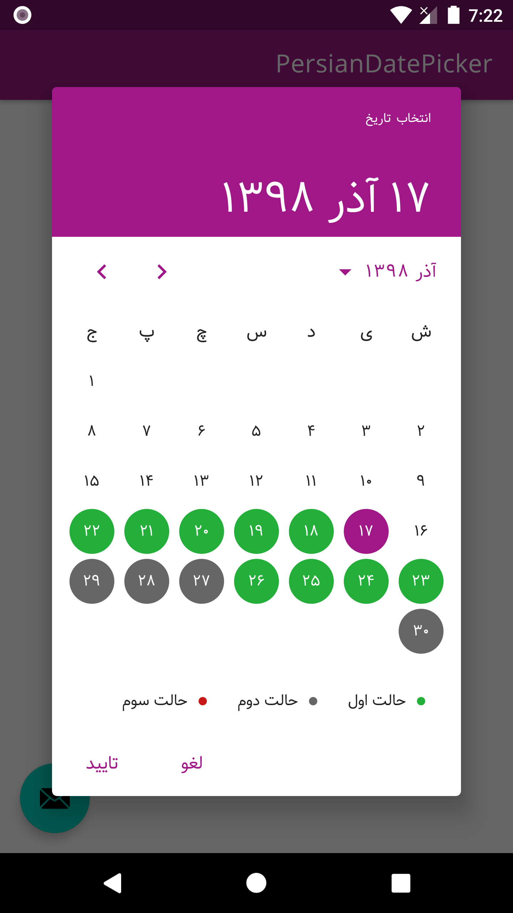

[](https://jitpack.io/#javaherisaber/PersianDatePicker)

# PersianDatePicker
Persian date picker for android based on material design specs



## Dependency
Top level build.gradle
```groovy
allprojects {
   repositories {
    ...
    maven { url 'https://jitpack.io' }
  }
}
```
Module level build.gradle
```groovy
dependencies {
  implementation "com.github.javaherisaber:PersianDatePicker:$versions.persianDatePicker"
}
```

## How to use
```kotlin
val calendar = MaterialDatePicker.clearedUtcCalendar()
calendar.timeInMillis = MaterialDatePicker.todayInUtcMilliseconds()
val colorState1 = ResourcesCompat.getColor(resources, R.color.colorCalendarState1, null)
val colorState2 = ResourcesCompat.getColor(resources, R.color.colorCalendarState2, null)
val colorState3 = ResourcesCompat.getColor(resources, R.color.colorCalendarState3, null)
val dayToColorMap = mutableMapOf<Long, Int>()
repeat(10) {
   dayToColorMap[calendar.timeInMillis] = colorState1
   calendar.add(Calendar.DAY_OF_MONTH, 1)
}
repeat(10) {
   dayToColorMap[calendar.timeInMillis] = colorState2
   calendar.add(Calendar.DAY_OF_MONTH, 1)
}
repeat(10) {
   dayToColorMap[calendar.timeInMillis] = colorState3
   calendar.add(Calendar.DAY_OF_MONTH, 1)
}
val hintTitleToColor = mapOf("state1" to colorState1, "state2" to colorState2, "state3" to colorState3)

val builder = MaterialDatePicker.Builder.datePicker()
val today = MaterialDatePicker.todayInUtcMilliseconds()
builder.setSelection(today)

val constraintsBuilder = CalendarConstraints.Builder()
constraintsBuilder.setStart(today) // start month
constraintsBuilder.setEnd(MaterialDatePicker.futureMonthInUtcMilliseconds(6)) // end month
constraintsBuilder.setOpenAt(today) // calendar first visible month when opening
constraintsBuilder.setDayToItemBackgroundColor(dayToColorMap)
constraintsBuilder.setHintTitleToColor(hintTitleToColor)

builder.setCalendarConstraints(constraintsBuilder.build())
val picker = builder.build()
picker.addOnPositiveButtonClickListener { selection ->
   Toast.makeText(
       applicationContext,
       "selection : $selection = ${picker.headerText}",
       Toast.LENGTH_LONG
   ).show()
}
picker.show(supportFragmentManager, picker.toString())
```
